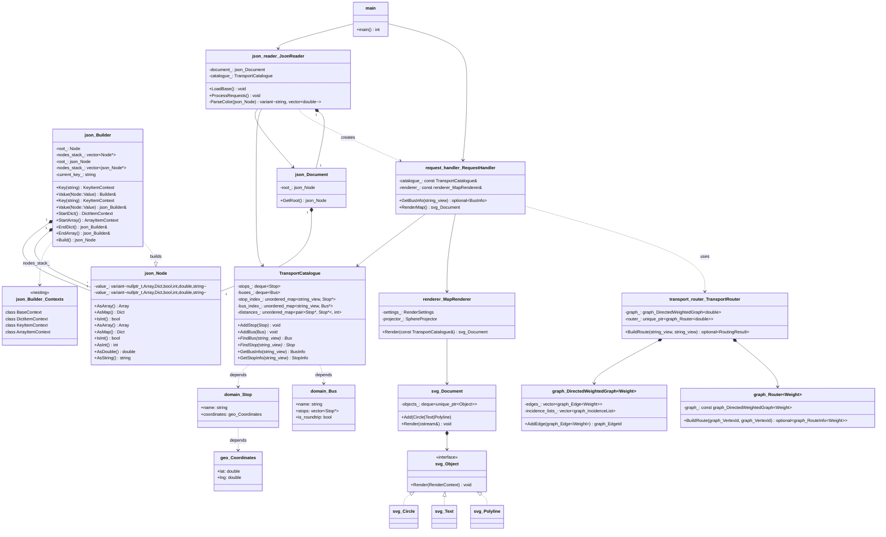

# cpp-transport-catalogue

## Описание
Консольное приложение для хранения и обработки данных об остановках и маршрутах общественного транспорта. Реализовано на C++17 с акцентом на:
- Эффективные структуры данных
- Быструю обработку запросов
- Визуализацию маршрутов (поддерживать графический вывод)
- Построение оптимальных путей (поиск маршрутов и вычисление времени поездки)

### Транспортный справочник (C++23)
▸ Система учёта автобусных маршрутов и остановок
▸ Обработка JSON-запросов и генерация ответов

### Основной функционал
| Функция | Описание | Технологии |
|---|---|---|
| Хранение данных | In-memory каталог с быстрым поиском | `unordered_map`, кастомное хеширование |
| Обработка JSON | Полный цикл запрос-ответ | Самописный парсер, `std::variant` |
| Визуализация | Генерация SVG карт с геопривязкой | Собственная SVG библиотека |
| Поиск пути | Алгоритм Дейкстры | Теория графов, взвешенные ребра |

### Производительность
|Операция|	Сложность	|Примечание|
|---|---|---|
|Добавление остановки|	O(1)|	Хеш-таблица|
|Поиск маршрута	|O(1)	|Индексирование|
|Построение пути	|O(E + V log V)|	Алгоритм Дейкстры|

**Технические особенности**
- ✅ STL-контейнеры (оптимизированный поиск)
- ✅ string_view + умные указатели
- ✅ Модульная архитектура (разделение на парсер, ядро, визуализацию)
- ✅ Шаблонные классы
- ✅ Runtime-полиморфизм с std::variant


**Демонстрируемые навыки**
- 🔸 Работу с памятью в C++
- 🔸 Реализацию графовых алгоритмов
- 🔸 Обработку сложных JSON-структур

## Возможная карта


### 1. Хранение данных
- **Остановки**: название + географические координаты
- **Маршруты**:
  - Кольцевые (A→B→C→A)
  - Линейные (A→B→C→B→A)
- **Расстояния** между остановками

### 2. Запросы через JSON

#### Пример входного JSON 
```json
  {
      "base_requests": [
          {
              "is_roundtrip": true,
              "name": "297",
              "stops": [
                  "Biryulyovo Zapadnoye",
                  "Biryulyovo Tovarnaya",
                  "Universam",
                  "Biryulyovo Zapadnoye"
              ],
              "type": "Bus"
          },
          {
              "is_roundtrip": false,
              "name": "635",
              "stops": [
                  "Biryulyovo Tovarnaya",
                  "Universam",
                  "Prazhskaya"
              ],
              "type": "Bus"
          },
          {
              "latitude": 55.574371,
              "longitude": 37.6517,
              "name": "Biryulyovo Zapadnoye",
              "road_distances": {
                  "Biryulyovo Tovarnaya": 2600
              },
              "type": "Stop"
          },
          {
              "latitude": 55.587655,
              "longitude": 37.645687,
              "name": "Universam",
              "road_distances": {
                  "Biryulyovo Tovarnaya": 1380,
                  "Biryulyovo Zapadnoye": 2500,
                  "Prazhskaya": 4650
              },
              "type": "Stop"
          },
          {
              "latitude": 55.592028,
              "longitude": 37.653656,
              "name": "Biryulyovo Tovarnaya",
              "road_distances": {
                  "Universam": 890
              },
              "type": "Stop"
          },
          {
              "latitude": 55.611717,
              "longitude": 37.603938,
              "name": "Prazhskaya",
              "road_distances": {},
              "type": "Stop"
          }
      ],
      "render_settings": {
          "bus_label_font_size": 20,
          "bus_label_offset": [
              7,
              15
          ],
          "color_palette": [
              "green",
              [
                  255,
                  160,
                  0
              ],
              "red"
          ],
          "height": 200,
          "line_width": 14,
          "padding": 30,
          "stop_label_font_size": 20,
          "stop_label_offset": [
              7,
              -3
          ],
          "stop_radius": 5,
          "underlayer_color": [
              255,
              255,
              255,
              0.85
          ],
          "underlayer_width": 3,
          "width": 200
      },
      "routing_settings": {
          "bus_velocity": 40,
          "bus_wait_time": 6
      },
      "stat_requests": [
          {
              "id": 1,
              "name": "297",
              "type": "Bus"
          },
          {
              "id": 2,
              "name": "635",
              "type": "Bus"
          },
          {
              "id": 3,
              "name": "Universam",
              "type": "Stop"
          },
          {
              "from": "Biryulyovo Zapadnoye",
              "id": 4,
              "to": "Universam",
              "type": "Route"
          },
          {
              "from": "Biryulyovo Zapadnoye",
              "id": 5,
              "to": "Prazhskaya",
              "type": "Route"
          }
      ]
  }
``` 

#### Пример взодного JSON с запросом на построение карты
```JSON
{
    "base_requests": [
    {
        "type": "Bus",
        "name": "114",
        "stops": ["Морской вокзал", "Ривьерский мост"],
        "is_roundtrip": false
    },
    {
        "type": "Stop",
        "name": "Ривьерский мост",
        "latitude": 43.587795,
        "longitude": 39.716901,
        "road_distances": {"Морской вокзал": 850}
    },
    {
        "type": "Stop",
        "name": "Морской вокзал",
        "latitude": 43.581969,
        "longitude": 39.719848,
        "road_distances": {"Ривьерский мост": 850}
    }
    ],
    "render_settings": {
    "width": 200,
    "height": 200,
    "padding": 30,
    "stop_radius": 5,
    "line_width": 14,
    "bus_label_font_size": 20,
    "bus_label_offset": [7, 15],
    "stop_label_font_size": 20,
    "stop_label_offset": [7, -3],
    "underlayer_color": [255,255,255,0.85],
    "underlayer_width": 3,
    "color_palette": ["green", [255,160,0],"red"]
    },
    "stat_requests": [
    { "id": 1, "type": "Map" },
    { "id": 2, "type": "Stop", "name": "Ривьерский мост" },
    { "id": 3, "type": "Bus", "name": "114" }
    ]
}
```

#### Выходной JSON со строкой изображения карты в формате SVG
```JSON
[
    {
        "map": "<?xml version=\"1.0\" encoding=\"UTF-8\" ?>\n<svg xmlns=\"http://www.w3.org/2000/svg\" version=\"1.1\">\n  <polyline points=\"100.817,170 30,30 100.817,170\" fill=\"none\" stroke=\"green\" stroke-width=\"14\" stroke-linecap=\"round\" stroke-linejoin=\"round\"/>\n  <text fill=\"rgba(255,255,255,0.85)\" stroke=\"rgba(255,255,255,0.85)\" stroke-width=\"3\" stroke-linecap=\"round\" stroke-linejoin=\"round\" x=\"100.817\" y=\"170\" dx=\"7\" dy=\"15\" font-size=\"20\" font-family=\"Verdana\" font-weight=\"bold\">114</text>\n  <text fill=\"green\" x=\"100.817\" y=\"170\" dx=\"7\" dy=\"15\" font-size=\"20\" font-family=\"Verdana\" font-weight=\"bold\">114</text>\n  <text fill=\"rgba(255,255,255,0.85)\" stroke=\"rgba(255,255,255,0.85)\" stroke-width=\"3\" stroke-linecap=\"round\" stroke-linejoin=\"round\" x=\"30\" y=\"30\" dx=\"7\" dy=\"15\" font-size=\"20\" font-family=\"Verdana\" font-weight=\"bold\">114</text>\n  <text fill=\"green\" x=\"30\" y=\"30\" dx=\"7\" dy=\"15\" font-size=\"20\" font-family=\"Verdana\" font-weight=\"bold\">114</text>\n  <circle cx=\"100.817\" cy=\"170\" r=\"5\" fill=\"white\"/>\n  <circle cx=\"30\" cy=\"30\" r=\"5\" fill=\"white\"/>\n  <text fill=\"rgba(255,255,255,0.85)\" stroke=\"rgba(255,255,255,0.85)\" stroke-width=\"3\" stroke-linecap=\"round\" stroke-linejoin=\"round\" x=\"100.817\" y=\"170\" dx=\"7\" dy=\"-3\" font-size=\"20\" font-family=\"Verdana\">Морской вокзал</text>\n  <text fill=\"black\" x=\"100.817\" y=\"170\" dx=\"7\" dy=\"-3\" font-size=\"20\" font-family=\"Verdana\">Морской вокзал</text>\n  <text fill=\"rgba(255,255,255,0.85)\" stroke=\"rgba(255,255,255,0.85)\" stroke-width=\"3\" stroke-linecap=\"round\" stroke-linejoin=\"round\" x=\"30\" y=\"30\" dx=\"7\" dy=\"-3\" font-size=\"20\" font-family=\"Verdana\">Ривьерский мост</text>\n  <text fill=\"black\" x=\"30\" y=\"30\" dx=\"7\" dy=\"-3\" font-size=\"20\" font-family=\"Verdana\">Ривьерский мост</text>\n</svg>",
        "request_id": 1
    },
    {
        "buses": [
            "114"
        ],
        "request_id": 2
    },
    {
        "curvature": 1.23199,
        "request_id": 3,
        "route_length": 1700,
        "stop_count": 3,
        "unique_stop_count": 2
    }
]
```
#### Визуализация ответа с запроса


**Пример работы с JSON:**

```cpp
json::Builder{}
    .StartDict()
        .Key("маршрут").StartArray()
            .Value("297").Value("635")
        .EndArray()
    .EndDict()
    .Build()
```


## UML диграмма классов

